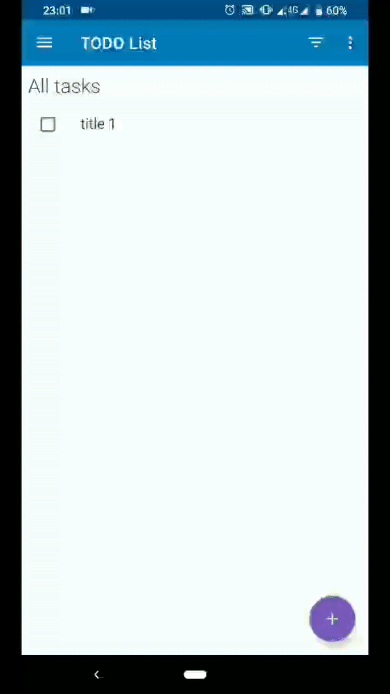

# todo-app
TODO Application. The Simple application for managing todo tasks.

## Stack
- Kotlin
- Kotlin coroutines
- MVVM
- Android Jetpack (Room, Data binding, LiveData, Navigation, ViewModel)

## Features
- Multi language support
- Add, Edit, Delete tasks
- Cancel deleting
- Tasks stats

## Screencast

